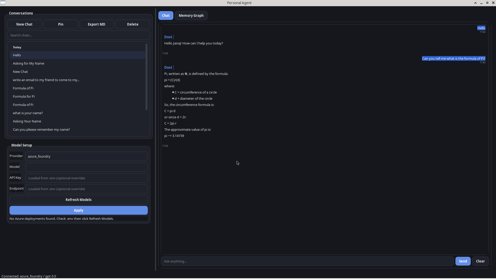

# Personal Agent

Production-oriented desktop chat application built with Python, PySide6, and pydantic-ai.



## Supported providers

- OpenAI
- Anthropic
- Google (Gemini)
- Azure Foundry (OpenAI-compatible model endpoint)

## Quick start

1. Install dependencies:

```bash
uv sync
```

2. Create environment file:

```bash
cp .env.example .env
```

3. Populate `.env` with provider credentials.

4. Run the app:

```bash
uv run personal-agent
```

## Production notes

- Configuration validation fails fast with clear messages for missing keys/endpoints.
- Chat requests run in a background worker to keep the UI responsive.
- Background event loops are shut down cleanly to avoid pending-task warnings.
- Session history is protected with a lock for safe multi-threaded access.
- Conversations are persisted to `~/.personal_agent/conversations.json` and can be reopened.
- Conversation titles start from first prompt, then get model-refined automatically.
- Conversation list supports full-text search across titles and message content.
- Chats can be pinned/favorited and exported as Markdown.
- Persistent memory is stored in a local text file and injected into each new conversation.
- Provider/model can be switched at runtime from the settings panel.

## Memory

- Default memory file: `~/.personal_agent/memory.txt`
- Optional override: `MEMORY_FILE_PATH`
- Memory is updated automatically by the agent from conversation turns.
- New chats inherit full memory context from the file.

## Documentation

- Architecture: `docs/ARCHITECTURE.md`
- Features: `docs/FEATURES.md`

## LibreChat-style model config

If you want model lists from a LibreChat config, set:

- `LIBRECHAT_CONFIG_PATH=/absolute/path/to/librechat.yaml`

Azure deployment names defined in that file are used as model options when runtime discovery is unavailable.

## Azure Foundry configuration

Set these variables for Azure Foundry models:

- `AZURE_FOUNDRY_API_KEY` (or `AZURE_OPENAI_API_KEY` or `AZURE_API_KEY`)
- `AZURE_FOUNDRY_ENDPOINT` (or `AZURE_ENDPOINT`)
- Optional: `AZURE_API_VERSION`

Example endpoint:

```text
https://<resource>.services.ai.azure.com/models
```
